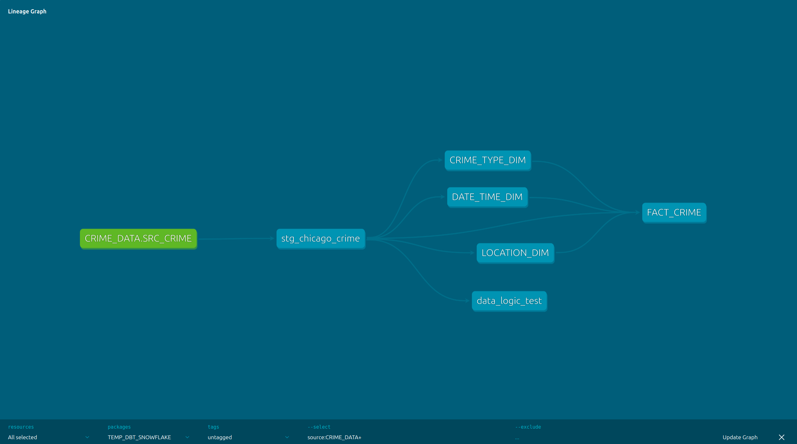

# Chicago Crime Data Transformation with dbt

## Overview
This project uses **dbt (Data Build Tool)** to transform and model Chicago crime data. The final star schema consists of fact and dimension tables optimized for analytics.


## Installation
To set up dbt for this project, install the required dependencies:
```sh
pip install dbt-core dbt-snowflake
```

### Verify Installation
Run the following command to ensure dbt is installed properly:
```sh
dbt --version
```
Expected output:
```
dbt Core: <version>
dbt Snowflake: <version>
```
### Initialize a New dbt Project
```sh
dbt-core init
```
Configure dbt profile


## Test the Connection
Once the profile is configured, run:
```sh
dbt debug
```
If successful, dbt is ready to use!

## Running dbt Models
Execute all models with:
```sh
dbt run
```
## Running dbt Tests
```sh
dbt test
```

## DBT Lineage Graph 

### Transformation Flow Overview
This **dbt lineage graph** represents the transformation flow of your **Chicago crime data** from the raw source table to the final fact and dimension tables.

### Source Table
- **`CRIME_DATA.SRC_CRIME`** (Green Node): This is the **raw data source**.

### Staging Layer
- **`stg_chicago_crime`** (Blue Node): A **staging model** that cleans and preps data from the raw source before transformation.

### Dimension Tables
- **`CRIME_TYPE_DIM`**: Holds crime types and descriptions.
- **`DATE_TIME_DIM`**: Stores crime date-time breakdown (year, month, day, etc.).
- **`LOCATION_DIM`**: Contains location details (latitude, longitude, community area, etc.).

### Fact Table
- **`FACT_CRIME`**: The **central fact table**, linking crimes with date, location, and type dimensions.

### Testing Node
- **`data_logic_test`**: A test model to validate data integrity and logic.

### Linage Graph



## Data Model - Star Schema
The project follows a star schema with the following tables:

### **Fact Table**
- **FACT_CRIME**: Stores crime incidents with keys referencing dimension tables.

### **Dimension Tables**
- **DATE_TIME_DIM**: Stores crime date and time details.
- **LOCATION_DIM**: Contains geographic details of crime locations.
- **CRIME_TYPE_DIM**: Stores crime classifications (primary type, description).

### ERD (Entity-Relationship Diagram)


